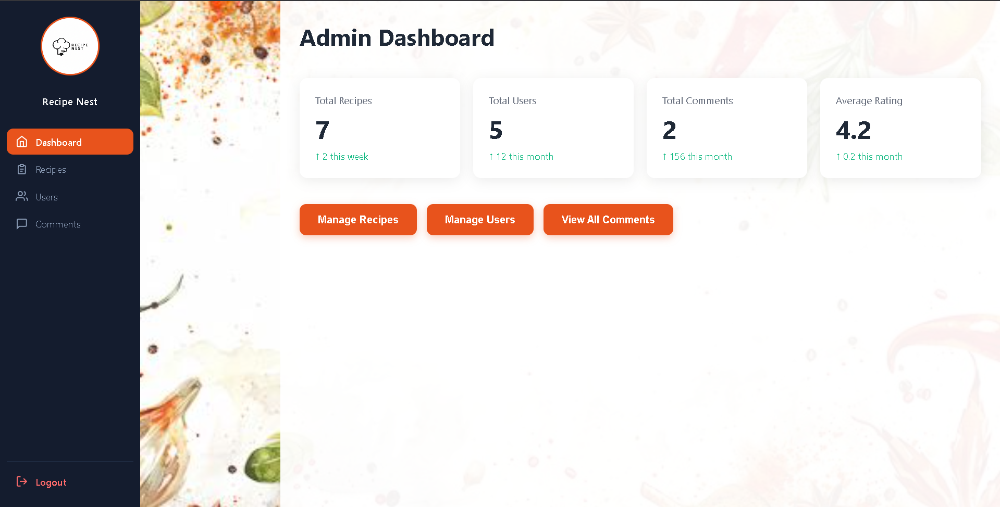
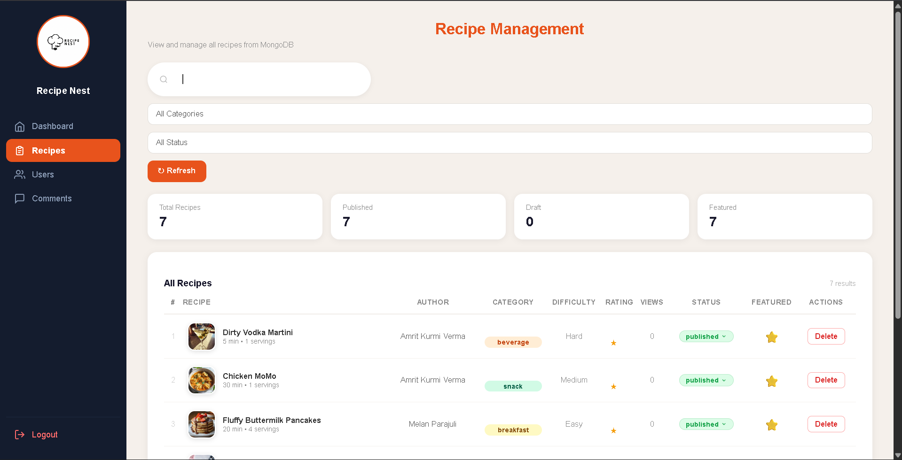
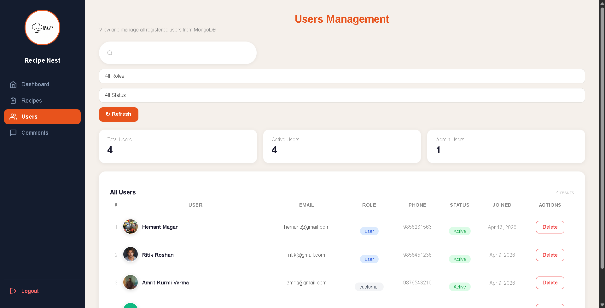
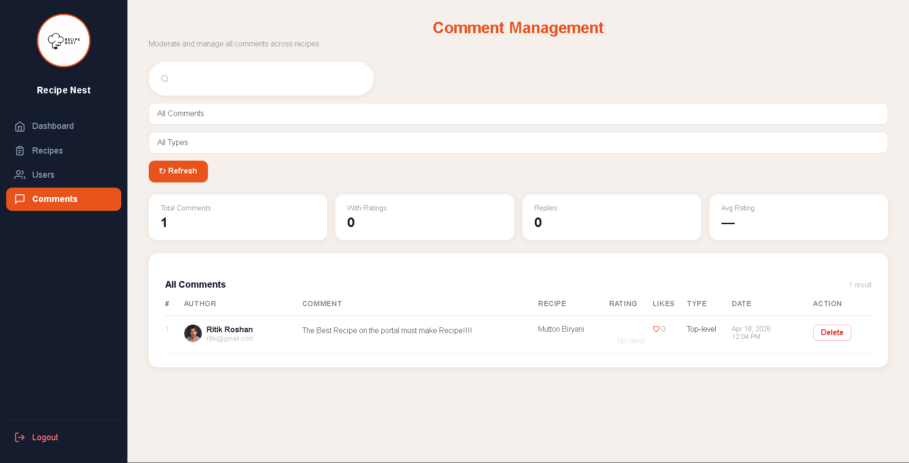

# 🍽️ RecipeNest

**RecipeNest** is a full-stack recipe sharing web application where food lovers can discover, create, save, and manage recipes. With a clean dark-themed UI and an intuitive navigation system, RecipeNest makes it easy for anyone to share their culinary creations with the world. The platform also includes a dedicated **Admin Portal** for managing users, recipes, and comments.

---

## 📁 Project Structure

```
RECIPENEST CODE/
├── backend/
│   └── src/
│       ├── config/
│       ├── controllers/
│       ├── middlewares/
│       ├── models/
│       ├── routes/
│       ├── services/
│       └── app.js
├── frontend/
│   └── src/
│       ├── assets/
│       ├── components/
│       ├── App.jsx
│       └── main.jsx
└── webfiles/
```

---

## 🚀 Tech Stack

- **Frontend:** React (Vite), CSS
- **Backend:** Node.js, Express.js
- **Database:** MongoDB (via Mongoose)
- **Auth:** JWT-based authentication with Role-based Access Control (Admin / User)
- **File Uploads:** Multer

---

## 📸 App Pages

---

### 1. 🏠 Landing Page

The entry point of the application. Users are greeted with a visually rich food background and two call-to-action buttons — **Get Started** (registration) and **Sign In** (login).


---

### 2. 🔐 Login Page

A glassmorphism-styled login form overlaid on the same food-themed background. Users enter their **email** and **password** to sign in, or navigate to the registration page via the **Register** link.


---

### 3. 🏡 Home Page

After logging in, users land on the Home page, which displays a personalized greeting, a **search bar**, and category filter pills — **All, Breakfast, Lunch, Dinner, Dessert, Beverage**. Recipes are shown as beautifully styled cards with cover images, descriptions, cook time, servings, and difficulty level. A success toast confirms the login.


---

### 4. 📋 My Recipes Page

The dedicated page for viewing all recipes posted by the currently logged-in user. Includes the same category filters and a recipe count badge. When no recipes exist yet, an empty state is shown with an **+ Add Recipe** call-to-action button.


---

### 5. ➕ Add Recipe Page

A full-featured recipe creation form where users can:
- Upload a **Cover Photo**
- Add up to **5 Gallery Images**
- Fill in **Basic Info** (title, description, category, cook time, servings, difficulty)
- Add ingredients and step-by-step instructions

The page includes a **Publish** button in the top-right corner to submit the recipe.


---

### 6. 🔖 Saved Recipes Page

Displays the user's personal collection of bookmarked recipes. Includes a **search bar** to filter saved items. Each recipe card shows the cover image, title, short description, cook time, servings, and difficulty. The bookmark icon turns filled/orange when a recipe is saved.


---

### 7. 👤 Profile Page — My Recipes Tab

The Profile page shows the user's avatar, display name, and three stats: **Recipes Posted, Saved, and Total Views**. Three tabs are available: **My Recipes**, **Saved**, and **Settings**. By default, the My Recipes tab is active and lists the user's published recipes.


---

### 8. 🔖 Profile Page — Saved Tab

Clicking the **Saved** tab on the Profile page shows a compact list view of the user's bookmarked recipes, including the recipe thumbnail, title, cook time, and the author's name.


---

### 9. ⚙️ Profile Page — Settings Tab (Profile Picture)

The **Settings** tab allows the user to manage their profile. The first section — **Profile Picture** — displays the current avatar with options to **Change Photo** or **Remove** it.


---

### 10. ⚙️ Profile Page — Settings Tab (Edit Profile & Account)

Scrolling further in the Settings tab reveals the **Edit Profile** section (name field with a **Save Changes** button) and the **Account** section which contains the **Logout** button.


---

## 🛡️ Admin Portal

RecipeNest includes a dedicated **Admin Portal** accessible only to users with the `admin` role. The portal provides full platform oversight — managing recipes, users, and comments from a clean, light-themed dashboard with a dark sidebar.

---

### 11. 📊 Admin Dashboard

The Admin Dashboard is the central hub of the admin portal. It displays four key platform metrics at a glance:
- **Total Recipes** — with a weekly growth indicator
- **Total Users** — with a monthly growth indicator
- **Total Comments** — with monthly activity
- **Average Rating** — with monthly change

Below the stats, three quick-action buttons — **Manage Recipes**, **Manage Users**, and **View All Comments** — allow the admin to navigate directly to each management section.

The sidebar includes navigation links for **Dashboard**, **Recipes**, **Users**, and **Comments**, along with a **Logout** button at the bottom.



---

### 12. 🍴 Recipe Management

The Recipe Management page gives the admin full visibility and control over all recipes stored in the database. At the top, a **search bar**, **category filter**, and **status filter** allow precise filtering. A **Refresh** button reloads the latest data.

Summary cards display:
- **Total Recipes**
- **Published** count
- **Draft** count
- **Featured** count

The recipe table lists each entry with its **thumbnail, title, author, category, difficulty, rating, view count, publish status** (with a dropdown to toggle), a **featured star toggle**, and a **Delete** button for removal.



---

### 13. 👥 Users Management

The Users Management page provides the admin with a complete view of all registered users pulled from MongoDB. Filters for **role** and **status**, along with a search bar and Refresh button, make it easy to find specific users.

Summary cards show:
- **Total Users**
- **Active Users**
- **Admin Users**

The users table lists each account with their **avatar, name, email, role badge** (user / customer / admin), **phone number, account status** (Active badge), **join date**, and a **Delete** button to remove the account.



---

### 14. 💬 Comment Management

The Comment Management page lets the admin moderate all comments across every recipe on the platform. A search bar, **All Comments** filter, and **All Types** filter help narrow down results. The page refreshes on demand via the **Refresh** button.

Summary cards display:
- **Total Comments**
- **With Ratings** count
- **Replies** count
- **Average Rating**

The comments table shows each entry's **author (with avatar and email), comment text, associated recipe, rating, like count, type** (Top-level or Reply), **date & time**, and a **Delete** button for moderation.



---

## ⚙️ Getting Started

### Prerequisites
- Node.js v18+
- MongoDB (local or Atlas)

### Backend Setup
```bash
cd backend
npm install
# Create a .env file with your MongoDB URI and JWT secret
npm start
```

### Frontend Setup
```bash
cd frontend
npm install
npm run dev
```

---

## 🌟 Features Summary

| Feature | Description |
|---|---|
| 🔐 Authentication | Register & login with JWT |
| 🏠 Home Feed | Browse all recipes with category filters & search |
| ➕ Add Recipe | Upload cover photo, gallery images, ingredients & steps |
| 🔖 Save Recipes | Bookmark favourite recipes |
| 👤 User Profile | View stats, manage recipes, edit name & avatar |
| 🚪 Logout | Secure session termination from profile settings |
| 🛡️ Admin Portal | Role-based admin dashboard for platform management |
| 🍴 Recipe Management | View, filter, feature, and delete any recipe |
| 👥 User Management | View, search, and delete registered users |
| 💬 Comment Moderation | Search, filter, and delete comments across all recipes |

---

> Built by Mr.Melan Parajuli 